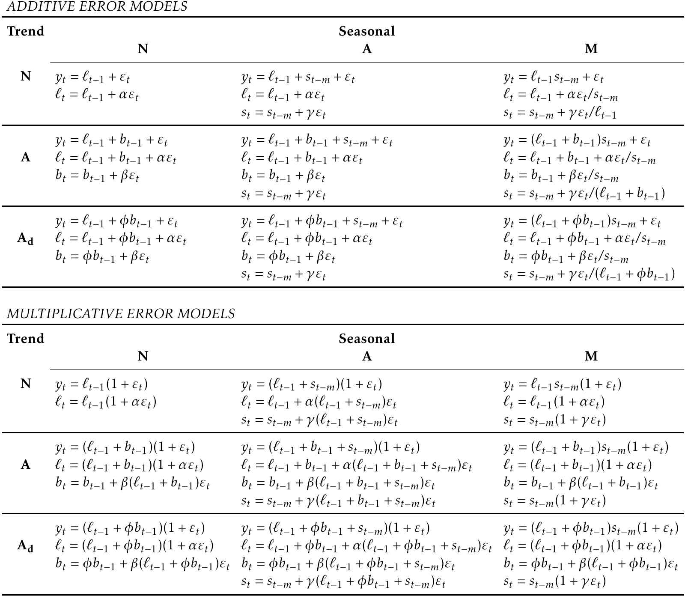

```{r setup, echo=FALSE}
library(knitr)
knitr::opts_chunk$set(echo = TRUE, fig.align="center", out.width = "5in")
```


```{r, echo=FALSE, message=FALSE}
library(fpp3)
```


# Forecasting basics

## Simple forecasting methods

Four simple forecasting methods:

- *Average method*: forecast all future values to be the average value of the data
- *Naive method*: simply set all forecasts to be the value of the last observation
- *Seasonal naive method*: set the forecast to be equal to the last observed value from the same season
- *Drift method*: set the forecast to be the value of the last observation with an increase or decrease equal to the average drift (change) seen in the historical data


### Example: Australian beer production

```{r}
aus_production %>% autoplot(Beer)
```

We use data from 1992Q1 to 2006Q4 as training data, and make forecast from 2007Q1 to 2010Q2.

```{r}
train <- aus_production %>%
  filter_index("1992 Q1" ~ "2006 Q4")
```

Fit the models with the four simple methods:

```{r}
# Fit the models
beer_fit <- train %>%
  model(
    Mean = MEAN(Beer),
    Naive = NAIVE(Beer),
    SNaive = SNAIVE(Beer),
    Drift = NAIVE(Beer ~ drift())
  )
# Generate forecasts for 14 quarters
beer_fc <- beer_fit %>% forecast(h = 14)
beer_fc
```

Plot forecasts against actual values.

```{r, message=FALSE}
beer_fc %>%
  autoplot(train, level = NULL) +
  autolayer(
    filter_index(aus_production, "2007 Q1" ~ .),
    color = "black"
  ) +
  labs(
    y = "Megalitres",
    title = "Forecasts for quarterly beer production"
  ) +
  guides(colour = guide_legend(title = "Forecast"))
```

## Residual diagnostics

A good forecasting method will yield innovation residuals with the following properties:

- The innovation residuals are uncorrelated. If there are correlations between innovation residuals, then there is information left in the residuals which should be used in computing forecasts.
- The innovation residuals have zero mean. If they have a mean other than zero, then the forecasts are biased.

In addition to these essential properties, it is useful (but not necessary) for the residuals to also have the following two properties.

- The innovation residuals have constant variance.
- The innovation residuals are normally distributed.

These two properties make the calculation of prediction intervals easier.


### Example: Google stock price

Stock prices are not observed every day (only trading days). There are implicit missing values (eg. weekends). We need to re-index based on trading days to make regular index intervals.

```{r}
goog_2015 <- gafa_stock %>%
  filter(Symbol == "GOOG", year(Date) == 2015) %>%
  mutate(day = row_number()) %>%
  update_tsibble(index = day, regular = TRUE)
```

Checking residual mean and correlations:

```{r, warning=FALSE}
goog_2015 %>%
  model(NAIVE(Adj_Close)) %>%
  gg_tsresiduals()
```

## Portmanteau test

We can test whether the first $l$ autocorrelations are significantly different from what would be expected from a white noise process. A test for a group of autocorrelations is called a portmanteau test.

### Box-Pierce test

$$ Q = T\sum_{k}^{l} \gamma_k^2 $$

### Ljung-Box test

$$ Q^* = T(T+2) \sum_{k}^{l} (T-k)^{-1} \gamma_k^2 $$
If the autocorrelations did come from a white noise series, then $Q$ and $Q^*$ would have a $\chi^2$ distribution with $(l-K)$ degrees of freedom, where $K$ is the number of parameters in the model. 

```{r}
aug <- goog_2015 %>%
  model(NAIVE(Close)) %>%
  augment()  # retrieve fitted value and residuals

aug %>% features(.innov, box_pierce, lag = 10, dof = 0)
aug %>% features(.innov, ljung_box, lag = 10, dof = 0)
```

## Prediction intervals

### One-step prediction intervals

When forecasting one step ahead, the standard deviation of the forecast distribution can be estimated using the standard deviation of the residuals given by

$$ \hat{\sigma} = \sqrt{\frac{1}{T-K}}\sum_{t=1}^T e_t^2$$

### Multi-step prediction intervals

A common feature of prediction intervals is that they usually increase in length as the forecast horizon increases. That is, $\sigma_h$ usually increases with $h$.

Compute prediction intervals:

```{r}
goog_2015 %>%
  model(NAIVE(Adj_Close)) %>%
  forecast(h = 10) %>%
  hilo() 
```

### Prediction intervals from bootstrap

We can simulate the next observation of a time series using

$$y_{T+1} = \hat{y}_{T+1|T} + e_{T+1}$$

where $\hat{y}$ is the fitted value from the model. $e_{T+1}$ is unknown, but can be approximated by errors in the past (residuals).

Adding the new simulated value $y_{T+1}$ to the dataset, we can iteratedly simulate $y_{T+2}, y_{T+3}, \dots$ 

Doing this repeatedly, we obtain many possible futures. This can be done using the `generate()` function.

```{r}
goog_2015 %>%
  model(NAIVE(Close)) %>%
  generate(h = 30, times = 5, bootstrap = TRUE) -> sim

goog_2015 %>%
  ggplot(aes(x = day)) +
  geom_line(aes(y = Close)) +
  geom_line(aes(y = .sim, colour = as.factor(.rep)), data = sim) 
```

By repeating predicting future paths thousands of times, we can compute prediction intervals by calculating percentiles of the future sample paths for each forecast horizon. 

```{r}
goog_2015 %>%
  model(NAIVE(Close)) %>% 
  forecast(h = 30, bootstrap = TRUE) -> fc

autoplot(fc, goog_2015)
```

### Box: How to plot forecasts?

`tabletools` provide convenient functions to plot forecast together with original data.

```{r, eval=FALSE}
# S3 method for fbl_ts
autoplot(object, data = NULL, level = c(80, 95), show_gap = TRUE, ...)
# S3 method for fbl_ts
autolayer(object, data = NULL, level = c(80, 95), point_forecast = list(mean = mean), show_gap = TRUE, ...)
```

Arguments:

- object: A fable.
- data: A tsibble with the same key structure as the fable.
- level: The confidence level(s) for the plotted intervals.
- show_gap: Setting this to FALSE will connect the most recent value in data with the forecasts.
- point_forecast: The point forecast measure (eg. mean, medium) to be displayed in the plot.


## Forecasting with decomposition

A time series can be decomposed into seasonal and seasonally-adjusted components.

$$ y_t =  \hat{S_t} + \hat{A_t} $$

Or, if a multiplicative decomposition has been used, 

$$ y_t = \hat{S_t} \hat{A_t} $$

To forecast seasonal time series, seasonal components can be forecasted using the seasonal naive method, while seasonally-adjusted components can be forecasted with any non-seasonal methods such as naive method or drift method.

This is made easy with the `decomposition_model()` function.

```{r}
us_retail_employment <- us_employment %>%
  filter(year(Month) >= 1990, Title == "Retail Trade")
fit_dcmp <- us_retail_employment %>%
  model(stlf = decomposition_model(
    STL(Employed ~ trend(window = 7), robust = TRUE),
    NAIVE(season_adjust)
  ))
fit_dcmp %>%
  forecast() %>%
  autoplot(us_retail_employment)+
  labs(y = "Number of people", title = "Monthly US retail employment")
```

## Evaluating point forecast accuracy

It is common practice to separate the available data into two portions, training data (in-sample data) and test data (out-of-sample data). The training data is used to estimate parameters of a forecasting method and the test data is used to evaluate its accuracy. 

A forecast “error” is defined as the difference between an observed value and its forecast.

$$ e_{T+h} = y_{T+h} - \hat{y}_{T+h|T}$$
where the training data is given by $(y_1, \dots, y_T)$ and the test data is given by $(y_{T+1}, y_{T+2}, \dots)$.


### Scale-dependent errors

Mean absolute error: $\text{MAE} = \text{mean} (|e_t|)$

Root mean squared error: $\text{RMSE} = \sqrt{\text{mean} (e_t^2)}$

MAE and RMSE has the same scale as the original data, therefore cannot be used to make comparisons between series that involve different units..


### Percentage errors

The percentage error is given by $p_t=100e_t/y_t$. Percentage errors have the advantage of being unit-free.

Mean absolute percentage error: $\text{MAPE} = \text{mean}(|p_t|)$.

Symmetric MAPE: $\text{sMAPE} = \text{mean}\left(200|y_{t} - \hat{y}_{t}|/(y_{t}+\hat{y}_{t})\right)$

Symmetric MAPE is symmetric on negative errors and positive errors.

Measures based on percentage errors have the disadvantage of being infinite or undefined if $y_t = 0$ for any t in the period of interest, and having extreme values if any $y_t$ is close to zero.


### Scaled errors 

Scaled errors is an alternative to using percentage errors when comparing forecast accuracy across series with different units. 

$$q_{j} = \frac{\displaystyle e_{j}}
    {\displaystyle\frac{1}{T-1}\sum_{t=2}^T |y_{t}-y_{t-1}|}$$

Mean absolute scaled error: $\text{MASE} = \text{mean}(|q_{j}|)$

Root mean squared scaled error: $\text{RMSSE} = \sqrt{\text{mean}(q_{j}^2)}$


### Example: Stock price forecast accuracy

The `accuracy()` function automatically compute various accuracy measures.

```{r}
goog_fit <- goog_2015 %>% 
  slice(1:(n()-30)) %>%
  model(
    Mean = MEAN(Close),
    Naive = NAIVE(Close),
    Drift = RW(Close ~ drift())
  )
goog_fc <- goog_fit %>% forecast(h=30)
accuracy(goog_fc, goog_2015)
```

## Evaluating distributional forecast accuracy

### Quantile score

Quantile score measures how well the observations $y_t$ fall into the quantile $f_{p,t}$ with probability $p$ as forecasted by the model. That is, we expect the observation $y_t$ to be less than $f_{p,t}$ with probability $p$. If the frequency that the real observations fall into this quantile deviates than $p$, there will be a penalty to the score. The more accurate, the smaller the score value. 

$$ Q_{p,t} = \begin{cases}
  2(1 - p) \big(f_{p,t} - y_{t}\big), & \text{if } y_{t} < f_{p,t} \\
  2p \big(y_{t} - f_{p,t}\big), & \text{if } y_{t} \ge f_{p,t}  \end{cases} $$

```{r}
goog_fc %>%
  filter(day == 230) %>%
  accuracy(goog_2015, list(qs=quantile_score), probs=0.10)
```

### Winkler score

The Winkler score is defined as the length of the interval plus a penalty if the observation is outside the interval. The narrow the interval, the less the observations outside the interval, the smaller the score. 

$$ W_{\alpha,t} = \begin{cases}
  (u_{\alpha,t} - \ell_{\alpha,t}) + \frac{2}{\alpha} (\ell_{\alpha,t} - y_t) & \text{if } y_t < \ell_{\alpha,t} \\
  (u_{\alpha,t} - \ell_{\alpha,t})   & \text{if }  \ell_{\alpha,t} \le y_t \le u_{\alpha,t} \\
  (u_{\alpha,t} - \ell_{\alpha,t}) + \frac{2}{\alpha} (y_t - u_{\alpha,t}) & \text{if } y_t > u_{\alpha,t}.
  \end{cases} $$

```{r}
goog_fc %>%
  filter(day == 230) %>%
  accuracy(goog_2015, list(winkler = winkler_score), level=80)
```


### Continuous ranked probability score

We can average the quantile scores over all values of $p$ to obtain the Continuous Ranked Probability Score or CRPS.

```{r}
goog_fc %>%
  accuracy(goog_2015, list(crps = CRPS))
```

### Skill score

Skill scores compute a forecast accuracy measure relative to some benchmark method.
It gives the proportion that one forecast method improves over the benchmark method.

$$ \frac{\text{CRPS}_{\text{Naive}} - \text{CRPS}_{\text{Drift}}}{\text{CRPS}_{\text{Naive}}} $$

```{r}
goog_fc %>%
  accuracy(goog_2015, list(skill = skill_score(CRPS)))
```
The `skill_score()` function can be used with any accuracy measure.


##  Time series cross validation

This procedure is sometimes known as “evaluation on a rolling forecasting origin” because the “origin” at which the forecast is based rolls forward in time.

The following diagram illustrates the series of training and test sets, where the blue observations form the training sets, and the red observations form the test sets (4
 -step-ahead forecasts).
 
```{r, echo=FALSE}
knitr::include_graphics("images/ccv1.png")
```


```{r}
goog_2015_tr <- goog_2015 %>%
  stretch_tsibble(.init = 3, .step = 1) %>%
  relocate(Date, Symbol, .id) 

goog_2015_tr %>%
  filter(.id < 250) %>%
  model(RW(Close ~ drift())) %>%
  forecast(h = 1) %>%
  accuracy(goog_2015)
```


# Time series regression models

## Multiple linear regression 

The general form of a multiple regression model is

$$ y_t = \beta_{0} + \beta_{1} x_{1,t} + \beta_{2} x_{2,t} + \cdots + \beta_{k} x_{k,t} + \varepsilon_t $$
where $y$ is the variable to be forecast and $x_1, \dots, x_k$ are $k$ predictor variables.

## Least square estimation

The `TSLM()` function fits a linear regression model to time series data.

```{r}
fit.consMR <- us_change %>%
  model(tslm = TSLM(Consumption ~ Income + Production + Unemployment + Savings))
report(fit.consMR)
```

Plot fitted value against original data:

```{r}
augment(fit.consMR) %>%
  ggplot(aes(x = Quarter)) +
  geom_line(aes(y = Consumption, colour = "Data")) +
  geom_line(aes(y = .fitted, colour = "Fitted")) +
  scale_color_manual(values=c(Data="black",Fitted="red")) 
```

## Diagnostic checking

Assumptions about the errors:

- they have mean zero; otherwise the forecasts will be systematically biased.
- they are not autocorrelated; otherwise the forecasts will be inefficient, as there is more information in the data that can be exploited.
- they are unrelated to the predictor variables; otherwise there would be more information that should be included in the systematic part of the model.

Use the `gg_tsresiduals()` function to obtain residual diagnostics.


```{r}
fit.consMR %>% gg_tsresiduals()
```

### Ljung-Box test

```{r}
augment(fit.consMR) %>%
  features(.innov, ljung_box, lag = 10, dof = 5)
```
### Spurious regression
Regressing non-stationary time series can lead to spurious regressions. 

These appear to be related simply because they both trend upwards in the same manner


Example: Australian air passengers on rice production in Guinea

```{r}
aus_airpassengers %>%
  filter(Year <= 2011) %>%
  left_join(guinea_rice, by = "Year") %>%
  pivot_longer(!Year) %>%
  ggplot(aes(x=Year, y=value)) + 
  geom_line() +
  facet_grid(name~., scales = "free")
```

```{r}
spurious_fit <- aus_airpassengers %>%
  filter(Year <= 2011) %>%
  left_join(guinea_rice, by = "Year") %>%
  model(TSLM(Passengers ~ Production))
report(spurious_fit)
```

Residual diagnostics:

```{r}
spurious_fit %>% gg_tsresiduals()
```

High $R^2$ and high residual autocorrelation can be signs of spurious regression.


## Model selection


### Cross validation

The procedure uses the following steps:

1. Remove observation $t$ from the data set, and fit the model using the remaining data. Then compute the error $e_t^{*} = y_t - \hat{y_t}$ for the omitted observation. (This is not the same as the residual because the $t$-th observation was not used in estimating the value of $\hat{y_t}$.
2. Repeat step 1 for $t=1,2,\dots, T$
3. Compute the MSE from $e_1^*, \dots, e_T^*$. We shall call this the CV.

The best model is the one with the smallest value of CV.

### Akaike’s Information Criterion 

$$ \text{AIC} = T\log\left(\frac{\text{SSE}}{T}\right) + 2(k+2) $$

The idea here is to penalise the fit of the model (SSE) with the number of parameters that need to be estimated.

The model with the minimum value of the AIC is often the best model for forecasting. 

### Schwarz’s Bayesian Information Criterion

$$ \text{BIC} = T\log\left(\frac{\text{SSE}}{T}\right) + (k+2)\log(T) $$

BIC tends to choose the model wither fewer terms than AIC, because the BIC penalises the number of parameters more heavily than the AIC. 


## Scenario based forecasting

In this setting, the forecaster assumes possible scenarios for the predictor variables that are of interest. For example, a US policy maker may be interested in comparing the predicted change in consumption when there is a constant growth of 1% and 0.5% respectively for income and savings.

```{r}
fit_consBest <- us_change %>%
  model(lm = TSLM(Consumption ~ Income + Savings + Unemployment))

future_scenarios <- scenarios(
  Increase = new_data(us_change, 4) %>%
    mutate(Income=1, Savings=0.5, Unemployment=0),
  Decrease = new_data(us_change, 4) %>%
    mutate(Income=-1, Savings=-0.5, Unemployment=0),
  names_to = "Scenario")

fc <- forecast(fit_consBest, new_data = future_scenarios)

us_change %>%
  autoplot(Consumption) +
  autolayer(fc) +
  labs(title = "US consumption", y = "% change")
```

# Exponential smoothing

Forecasts produced using exponential smoothing methods are weighted averages of past observations, with the weights decaying exponentially as the observations get older. In other words, the more recent the observation the higher the associated weight. 

## Simple exponential smoothing

Simple exponential smoothing (SEM) forecasts are calculated by

\begin{equation}
  \hat{y}_{T+1|T} = \alpha y_T + \alpha(1-\alpha) y_{T-1} + \alpha(1-\alpha)^2 y_{T-2}+ \cdots
\end{equation}

Or written in a recursive form

$$ \hat{y}_{T+1|T} = \alpha y_T + (1-\alpha) \hat{y}_{T|T-1} $$

where $0 \leq \alpha \leq 1$ is the smoothing parameter. The one-step-ahead forecast for time $T+1$ is a weighted average of all of the observations in the series $y_1,\dots, y_T$. The rate at which the weights decrease is controlled by the parameter $\alpha$. 

**Component form**

An alternative representation is the component form. 

\begin{align*}
  \text{Forecast equation}  && \hat{y}_{t+h|t} & = \ell_{t}\\
  \text{Smoothing equation} && \ell_{t}        & = \alpha y_{t} + (1 - \alpha)\ell_{t-1},
\end{align*}

where $\ell_t$ is the level (or the smoothed value) of the series at time $t$. 

**Estimation of parameters**

The unknown parameters of exponential smoothing method can be estimated by minimising the SSE (sum of squared errors).

\begin{equation}
 \text{SSE}=\sum_{t=1}^T(y_t - \hat{y}_{t|t-1})^2=\sum_{t=1}^Te_t^2
\end{equation}


### Example: Algerian exports

```{r}
algeria_economy <- global_economy %>%
  filter(Country == "Algeria")

algeria_economy %>%
  model(ETS(Exports ~ error("A") + trend("N") + season("N"))) %>%
  forecast(h=5) %>%
  autoplot(algeria_economy)
```

## Method with trend

### Holt’s linear trend method

\begin{align*}
  \text{Forecast equation}&& \hat{y}_{t+h|t} &= \ell_{t} + hb_{t} \\
  \text{Level equation}   && \ell_{t} &= \alpha y_{t} + (1 - \alpha)(\ell_{t-1} + b_{t-1})\\
  \text{Trend equation}   && b_{t}    &= \beta^*(\ell_{t} - \ell_{t-1}) + (1 -\beta^*)b_{t-1},
\end{align*}

where $\ell_t$ denotes an estimate of the level of the series at time $t$, $b_t$ denotes an estimate of the trend (slope) of the series at time $t$, $\alpha$ is the smoothing parameter for the level,  and $\beta^*$  is the smoothing parameter for the trend.  

As with simple exponential smoothing, the level equation here shows that $l_t$ is a weighted average of observation $y_t$ and the one-step-ahead training forecast for time $t$, here given by  $\ell_{t-1}+b_{t-1}$. The trend equation shows that $b_t$ is a weighted average of the estimated trend at time $t$ based on $l_t - \ell_{t-1}$ and $b_{t-1}$, the previous estimate of the trend.

### Damped trend methods

This method introduced a parameter that “dampens” the trend to a flat line some time in the future.

\begin{align*}
  \hat{y}_{t+h|t} &= \ell_{t} + (\phi+\phi^2 + \dots + \phi^{h})b_{t} \\
  \ell_{t} &= \alpha y_{t} + (1 - \alpha)(\ell_{t-1} + \phi b_{t-1})\\
  b_{t} &= \beta^*(\ell_{t} - \ell_{t-1}) + (1 -\beta^*)\phi b_{t-1}.
\end{align*}

where $\phi$ is the damping parameter $0<\phi<1$ which dampens the trend as $h\to\infty$.


### Example: Australian Population

```{r}
aus_economy <- global_economy %>%
  filter(Code == "AUS") %>%
  mutate(Pop = Population / 1e6)
aus_economy %>%
  model(
    `Holt's method` = ETS(Pop ~ error("A") + trend("A") + season("N")),
    `Damped Holt's method` = ETS(Pop ~ error("A") + trend("Ad", phi = 0.9) + season("N"))
  ) %>%
  forecast(h = 15) %>%
  autoplot(aus_economy, level = NULL)
```

## Method with seasonality

### Holt-Winters’ additive method

\begin{align*}
  \hat{y}_{t+h|t} &= \ell_{t} + hb_{t} + s_{t+h-m(k+1)} \\
  \ell_{t} &= \alpha(y_{t} - s_{t-m}) + (1 - \alpha)(\ell_{t-1} + b_{t-1})\\
  b_{t} &= \beta^*(\ell_{t} - \ell_{t-1}) + (1 - \beta^*)b_{t-1}\\
  s_{t} &= \gamma^* (y_{t}-\ell_{t}) + (1-\gamma^*)s_{t-m},
\end{align*}

$m$ denotes the frequency of the seasonality (eg. $m=4$ for quarterly data, $m=12$ for monthly data). 
$k$ is the $\lfloor (h-1)/m \rfloor$, which ensures that the estimates of the seasonal indices used for forecasting come from the final year of the sample. 
The level equation shows a weighted average between the seasonally-adjusted observation $(y_t-s_{t-m})$ and the non-seasonal forecast $(\ell_{t-1} + b_{t-1})$.
The trend equation is identical to Holt’s linear method. The seasonal equation shows a weighted average between the current seasonal index $(y_t-l_t)$ and the seasonal index of the same season last year.

### Holt-Winters’ multiplicative method

\begin{align*}
  \hat{y}_{t+h|t} &= (\ell_{t} + hb_{t})s_{t+h-m(k+1)} \\
  \ell_{t} &= \alpha \frac{y_{t}}{s_{t-m}} + (1 - \alpha)(\ell_{t-1} + b_{t-1})\\
  b_{t} &= \beta^*(\ell_{t}-\ell_{t-1}) + (1 - \beta^*)b_{t-1}                \\
  s_{t} &= \gamma \frac{y_{t}}{(\ell_{t-1} + b_{t-1})} + (1 - \gamma)s_{t-m}
\end{align*}

### Example: Domestic overnight trips in Australia

```{r}
aus_holidays <- tourism %>%
  filter(Purpose == "Holiday") %>%
  summarise(Trips = sum(Trips)/1e3)

aus_holidays %>%
  model(
    additive = ETS(Trips ~ error("A") + trend("A") + season("A")),
    multiplicative = ETS(Trips ~ error("M") + trend("A") + season("M"))
  ) %>%
  forecast(h = "3 years") %>%
  autoplot(aus_holidays, level = NULL) 
```

### Summary: Taxonomy of exponential smoothing methods

```{r, echo=FALSE}
knitr::include_graphics("images/ets1.png")
```


## Innovations state space models

The exponential smoothing methods presented are algorithms which generate point forecasts. State space models are the statistical models that underlie the exponential smoothing methods.

**ETS(A,N,N): simple exponential smoothing with additive errors**

\begin{align*}
  \text{Measurement equation} && y_t &= \ell_{t-1} + \varepsilon_t \\
  \text{State equation} && \ell_t&=\ell_{t-1}+\alpha \varepsilon_t
\end{align*}

These two equations, together with the statistical distribution of the errors, form a fully specified statistical model. Specifically, these constitute an innovations state space model underlying simple exponential smoothing.

The measurement equation shows the relationship between the observations and the unobserved states. 
The state equation shows the evolution of the state through time. 

**ETS(M,N,N): simple exponential smoothing with multiplicative errors**

\begin{align*}
  y_t&=\ell_{t-1}(1+\varepsilon_t)\\
  \ell_t&=\ell_{t-1}(1+\alpha \varepsilon_t)
\end{align*}

**ETS(A,A,N): Holt’s linear method with additive errors**

\begin{align*}
y_t&=\ell_{t-1}+b_{t-1}+\varepsilon_t\\
\ell_t&=\ell_{t-1}+b_{t-1}+\alpha \varepsilon_t\\
b_t&=b_{t-1}+\beta \varepsilon_t
\end{align*}


**ETS(M,A,N): Holt’s linear method with multiplicative errors**

\begin{align*}
y_t&=(\ell_{t-1}+b_{t-1})(1+\varepsilon_t)\\
\ell_t&=(\ell_{t-1}+b_{t-1})(1+\alpha \varepsilon_t)\\
b_t&=b_{t-1}+\beta(\ell_{t-1}+b_{t-1}) \varepsilon_t
\end{align*}

**Other ETS models**

```{r, echo=FALSE}

```

# ARIMA models

## Time series properties

### Stationarity and unit root

A stationary time series is one whose statistical properties do not depend on the time at which the series is observed. The existence of unit root is one common reason for non-stationarity. 

Existence of unit root can be tested with KPSS test. The null hypothesis is that the data are stationary. Small p-values lead to rejection of the null hypothesis, suggesting that differencing is required.

```{r}
goog_2015 %>%
  features(Close, unitroot_kpss)
```
First difference:

```{r}
goog_2015 %>%
  mutate(diff_close = difference(Close)) %>%
  features(diff_close, unitroot_kpss)
```

This process of using a sequence of KPSS tests to determine the appropriate number of first differences is carried out using the `unitroot_ndiffs()` function.

```{r}
goog_2015 %>%
  features(Close, unitroot_ndiffs)
```

### ACF and PACF

ACF plot shows the autocorrelations which measure the relationship between $y_t$ and $y_{t-k}$. PACF (partial autocorrelations) measure the relationship between $y_t$ and $y_{t-k}$ after removing the effects of lags $1,2,3,\dots,k-1$.

The data may follow an ARIMA$(p,d,0)$ model if the ACF and PACF plots of the differenced data show the following patterns:

- the ACF is exponentially decaying or sinusoidal;
- there is a significant spike at lag $p$ in the PACF, but none beyond lag $p$.

The data may follow an ARIMA$(0,d,q)$ model if the ACF and PACF plots of the differenced data show the following patterns:

- the PACF is exponentially decaying or sinusoidal;
- there is a significant spike at lag $q$ in the ACF, but none beyond lag $q$.

```{r}
global_economy %>%
  filter(Code == "EGY") %>%
  ACF(Exports) %>%
  autoplot()

global_economy %>%
  filter(Code == "EGY") %>%
  PACF(Exports) %>%
  autoplot()
```

`gg_tsdisplay` plots a time series along with its ACF and PACF.

```{r}
global_economy %>%
  filter(Code == "EGY") %>%
  gg_tsdisplay(Exports, plot_type = "partial")
```


## Non-seasonal ARIMA models


**ARIMA $(p,d,q)$ model**: $p$ is the order of the autoregressive part; $d$ is the degree of first differencing involved; $q$ is the order of the moving average part.

\begin{equation}
  \begin{array}{c c c c}
    (1-\phi_1B - \cdots - \phi_p B^p) & (1-B)^d y_{t} &= &c + (1 + \theta_1 B + \cdots + \theta_q B^q)\varepsilon_t\\
    {\uparrow} & {\uparrow} & &{\uparrow}\\
    \text{AR($p$)} & \text{$d$ differences} & & \text{MA($q$)}\\
  \end{array}
\end{equation}

The constant $c$ has an important effect on the long-term forecasts obtained from these models.

- If $c=0$ and $d=0$, the long-term forecasts will go to zero.
- If $c=0$ and $d=1$, the long-term forecasts will go to a non-zero constant.
- If $c=0$ and $d=2$, the long-term forecasts will follow a straight line.
- If $c\neq 0$ and $d\neq 0$, the long-term forecasts will go to the mean of the data.
- If $c\neq 0$ and $d=1$, the long-term forecasts will follow a straight line.
- If $c\neq 0$ and $d=2$, the long-term forecasts will follow a quadratic trend. (This is not recommended, and `fable` will not permit it.)

The value of $d$ also has an effect on the prediction intervals -- the higher the value of dd, the more rapidly the prediction intervals increase in size. For $d=0$, the long-term forecast standard deviation will go to the standard deviation of the historical data, so the prediction intervals will all be essentially the same.

The value of $p$ is important if the data show cycles. To obtain cyclic forecasts, it is necessary to have $p \geq 2$, along with some additional conditions on the parameters. For an AR(2) model, cyclic behaviour occurs if $\phi_1^2+4\phi_2<0$ (as is the case for the Egyptian Exports model). In that case, the average period of the cycles is $\frac{2\pi}{\text{arc cos}(-\phi_1(1-\phi_2)/(4\phi_2))}$.


## Modelling procedure and forecasting

### Automatic modelling 

`fable` automatic chooses the optimal parameters for ARIMA model with the following procedure:

1.	The number of differences $0 \leq d \leq 2$ is determined using repeated KPSS tests.
2.	The values of pp and qq are then chosen by minimising the AICc after differencing the data dd times. Rather than considering every possible combination of $p$ and $q$.


```{r}
fit <- global_economy %>%
  filter(Code == "EGY") %>%
  model(ARIMA(Exports))
report(fit)
```

### Manually model selection


The following procedure provides a useful general approach for manually selecting models.

1.	Plot the data and identify any unusual observations.
2.	If necessary, transform the data (using a Box-Cox transformation) to stabilise the variance.
3.	If the data are non-stationary, take first differences of the data until the data are stationary.
4.	Examine the ACF/PACF: Is an ARIMA$(p,d,0)$ or ARIMA$(0,d,q)$ model appropriate?
5.	Try your chosen model(s), and use the AICc to search for a better model.
6.	Check the residuals from your chosen model by plotting the ACF of the residuals, and doing a portmanteau test of the residuals. If they do not look like white noise, try a modified model.
7.	Once the residuals look like white noise, calculate forecasts.

We can specify particular values using function `pdq()`:

```{r}
fit2 <- global_economy %>%
  filter(Code == "EGY") %>%
  model(ARIMA(Exports ~ pdq(4,0,0)))
report(fit2)
```
To select an ARIMA model with a constant, we could use `ARIMA(y ~ 1 + ...)`. Similarly, a constant can be excluded with `ARIMA(y ~ 0 + ...)`.

### Forecasting with the ARIMA model

```{r}
fit %>% forecast(h=10) %>%
  autoplot(global_economy) +
  labs(y = "% of GDP", title = "Egyptian Exports")
```

## Seasonal ARIMA models

A seasonal ARIMA model is formed by including additional seasonal terms in the ARIMA models. It is written as ARIMA$(p,d,q)(P,D,Q)_m$.

The seasonal part of the model consists of terms that are similar to the non-seasonal components of the model, but involve backshifts of the seasonal period. For example, an ARIMA$(1,1,1)(1,1,1)_4$ model (without a constant) for quarterly data is

$$(1 - \phi_{1}B)~(1 - \Phi_{1}B^{4}) (1 - B) (1 - B^{4})y_{t} =
  (1 + \theta_{1}B)~ (1 + \Theta_{1}B^{4})\varepsilon_{t}$$

The seasonal part of an AR or MA model will be seen in the seasonal lags of the PACF and ACF. For example, an ARIMA$(0,0,0)(0,0,1)_12$ model will show:

- a spike at lag 12 in the ACF but no other significant spikes;
- exponential decay in the seasonal lags of the PACF (i.e., at lags 12, 24, 36, …).

Similarly, an ARIMA$(0,0,0)(1,0,0)_12$ model will show:

- exponential decay in the seasonal lags of the ACF;
- a single significant spike at lag 12 in the PACF.

### Example: Monthly US leisure and hospitality employment


```{r, message=FALSE}
leisure <- us_employment %>%
  filter(Title == "Leisure and Hospitality",
         year(Month) > 2000) %>%
  mutate(Employed = Employed/1000) %>%
  select(Month, Employed)
leisure %>% autoplot()
```
Take a seasonal difference and then a first-difference to achieve stationarity. 

```{r, warning=FALSE}
leisure %>% 
  gg_tsdisplay(difference(Employed, 12) %>% difference(), plot_type = "partial")
```

Using the PACF to select the non-seasonal part of the model and the ACF to select the seasonal part of the model. The significant spike at lag 2 in the PACF suggest an AR(2) component. The significant spike at lag 12 in the ACF suggests a seasonal MA(1) component. Consequently, we start with an ARIMA$(2,1,0)(0,1,1)_12$ model.

```{r}
fit <- leisure %>%
  model(
    arima = ARIMA(Employed ~ pdq(2,1,0) + PDQ(0,1,1)),
    auto = ARIMA(Employed, stepwise = FALSE, approx = FALSE)
  )
```

Check residuals of the model:

```{r}
fit %>% select(arima) %>% gg_tsresiduals(lag=36)
```

Forecasting:

```{r}
forecast(fit, h=36) %>%
  autoplot(leisure) +
  labs(title = "US employment: leisure and hospitality")
```

# Dynamic regression models

ARIMS models only allow for the inclusion of information from past observations of a series, but not for the inclusion of other information that may also be relevant. 
We now consider how to extend ARIMA models in order to allow other information to be included in the models.
We will allow the errors from a regression to contain autocorrelation. For example,

\begin{align*}
  y_t &= \beta_0 + \beta_1 x_{1,t} + \dots + \beta_k x_{k,t} + \eta_t,\\
      & (1-\phi_1B)(1-B)\eta_t = (1+\theta_1B)\varepsilon_t,
\end{align*}

Notice that the model has two error terms here — the error from the regression model, which we denote by $\eta_t$, and the error from the ARIMA model, which we denote by $\epsilon_t$.
Only the ARIMA model errors are assumed to be white noise.

## Regression with ARIMA errors

The `fable` function `ARIMA()` will fit a regression model with ARIMA errors if exogenous regressors are included in the formula.

```{r, eval=FALSE}
ARIMA(y ~ x + pdq(1,1,0))
```

If `pdq()` is not specified, `ARIMA()` will automatically select the best ARIMA model for the errors.

We may also include lagged predictors in the model:

```{r, eval=FALSE}
ARIMA(y ~ x + lag(x) + lag(x,2) + pdq(1,1,0))
```

### Example: US Personal Consumption and Income

```{r}
fit <- us_change %>%
  model(ARIMA(Consumption ~ Income))
report(fit)
```

We can recover estimates of both the $\eta_t$ and $\epsilon_t$ series using the `residuals()` function.

```{r}
bind_rows(
    `Regression residuals` =
        as_tibble(residuals(fit, type = "regression")),
    `ARIMA residuals` =
        as_tibble(residuals(fit, type = "innovation")),
    .id = "type"
  ) %>%
  ggplot(aes(x = Quarter, y = .resid)) +
  geom_line() +
  facet_grid(vars(type))
```

Check the residuals:

```{r}
fit %>% gg_tsresiduals()
```

To forecast using a regression model with ARIMA errors, we need to forecast the regression part of the model and the ARIMA part of the model, and combine the results. When the predictors are unknown, we must assume future values for each predictor.

We will calculate forecasts for the next eight quarters assuming that the future percentage changes in personal disposable income will be equal to the mean value from the last forty years.

```{r}
us_change_future <- new_data(us_change, 8) %>%
  mutate(Income = mean(us_change$Income))

forecast(fit, new_data = us_change_future) %>%
  autoplot(us_change) +
  labs(y = "Percentage change")
```

## Stochastic and deterministic trends

There are two different ways of modelling a linear trend. A deterministic trend is obtained using the regression model

$$y_t = \beta_0 + \beta_1 t + \eta_t,$$

where $\eta_t$ is an ARMA process. A stochastic trend is obtained using the model

$$y_t = \beta_0 + \beta_1 t + \eta_t,$$

where $\eta_t$ is an ARIMA process with $d=1$. 


The deterministic trend model is obtained as follows:

```{r}
fit_deterministic <- aus_airpassengers %>%
  model(deterministic = ARIMA(Passengers ~ 1 + trend() + pdq(d = 0)))
```


Alternatively, the stochastic trend model can be estimated as follows:

```{r}
fit_stochastic <- aus_airpassengers %>%
  model(stochastic = ARIMA(Passengers ~ pdq(d = 1)))
```

The variance of a deterministic trend is constant around its trend. However, the variance of a stochastic trend increases over time. 
Therefore, stochastic trends have much wider prediction intervals.

```{r}
aus_airpassengers %>%
  autoplot(Passengers) +
  autolayer(fit_stochastic %>% forecast(h = 20),
    colour = "blue", level = 95) +
  autolayer(fit_deterministic %>% forecast(h = 20),
    colour = "red", alpha = 0.5, level = 95)
```

## Dynamic harmonic regression

When there are long seasonal periods, a dynamic regression with Fourier terms is often better than other seasonality models.

With monthly data (period = 12), `fourier()` will include various Fourier terms (sin and cos pairs) in the regression by specifying the parameter $K$.

\begin{align*}
K = 1 && \sin(\frac{\pi}{12}) && \cos(\frac{\pi}{12}) \\
K = 2 && \sin(\frac{\pi}{12}) && \cos(\frac{\pi}{12}) && 
         \sin(\frac{2\pi}{12}) && \cos(\frac{2\pi}{12}) \\
K = 3 && \sin(\frac{\pi}{12}) && \cos(\frac{\pi}{12}) && 
         \sin(\frac{2\pi}{12}) && \cos(\frac{2\pi}{12}) && 
         \sin(\frac{3\pi}{12}) && \cos(\frac{3\pi}{12}) \\
\vdots 
\end{align*}

As $K$ increases the Fourier terms capture and project a more “wiggly” seasonal pattern. The maximum $K$ allowed is period/2.

  
### Example: Australian eating out expenditure

```{r}
aus_cafe <- aus_retail %>%
  filter(
    Industry == "Cafes, restaurants and takeaway food services",
    year(Month) %in% 2004:2018
  ) %>%
  summarise(Turnover = sum(Turnover))

fit <- model(aus_cafe,
  `K = 1` = ARIMA(log(Turnover) ~ fourier(K=1) + PDQ(0,0,0)),
  `K = 2` = ARIMA(log(Turnover) ~ fourier(K=2) + PDQ(0,0,0)),
  `K = 3` = ARIMA(log(Turnover) ~ fourier(K=3) + PDQ(0,0,0)),
  `K = 4` = ARIMA(log(Turnover) ~ fourier(K=4) + PDQ(0,0,0)),
  `K = 5` = ARIMA(log(Turnover) ~ fourier(K=5) + PDQ(0,0,0)),
  `K = 6` = ARIMA(log(Turnover) ~ fourier(K=6) + PDQ(0,0,0))
)

fit %>%
  forecast(h = "2 years") %>%
  autoplot(aus_cafe, level = 95) +
  facet_wrap(vars(.model), ncol = 2) +
  guides(colour = FALSE, fill = FALSE, level = FALSE) 
```

